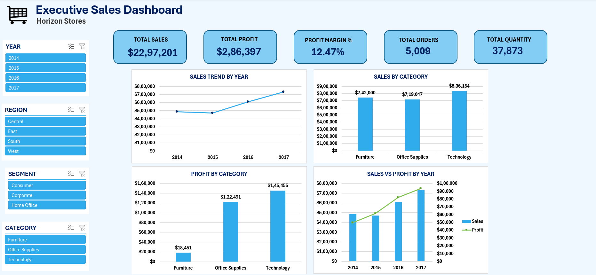
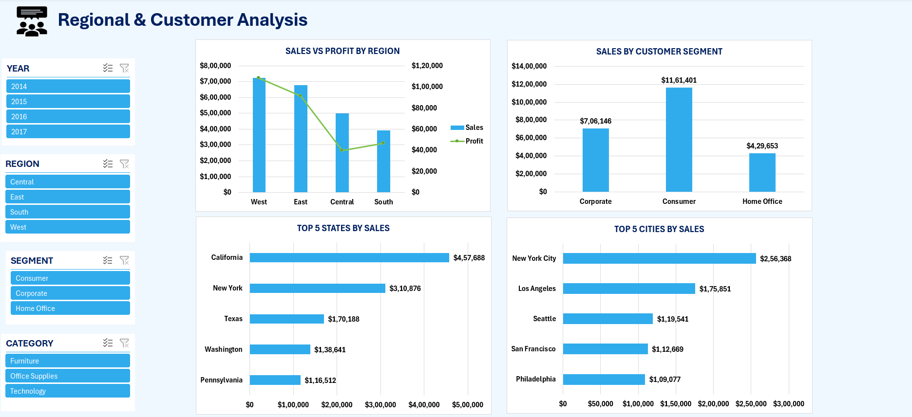
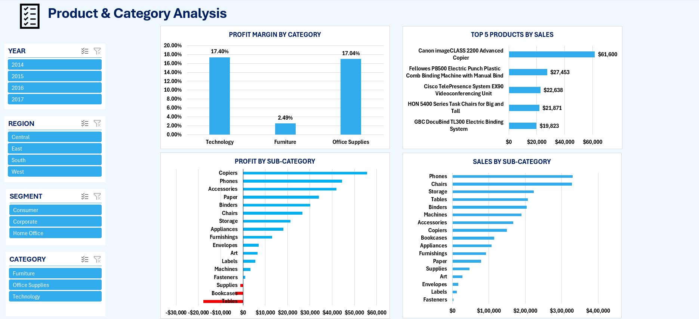
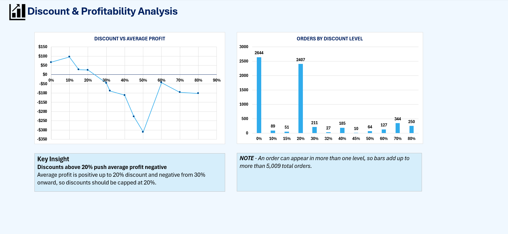
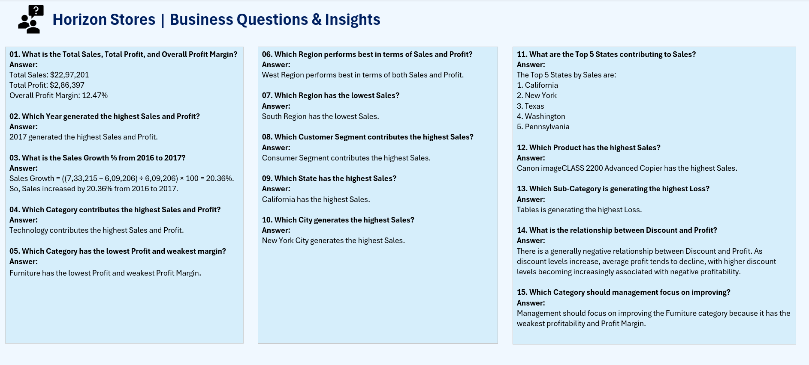
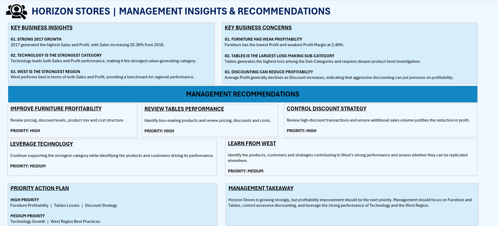

# Horizon Stores: Executive Sales Dashboard

An interactive Excel dashboard analysing sales, profit, regions, products and discounting (2014-2017), with business Q&A and management recommendations.

## Business Objective
Understand where the store makes and loses money, and what management should do to improve profitability.

## Dataset
Built on the public Sample Superstore dataset from Kaggle (US retail orders, 2014-2017). "Horizon Stores" is a fictional store name used for this project.

## Tools Used
Excel (charts, slicers, formulas, dashboard design)

## Dashboard Pages
1. Executive Sales Dashboard
2. Regional & Customer Analysis
3. Product & Category Analysis
4. Discount & Profitability Analysis
5. Business Questions & Insights (15 questions answered)
6. Management Insights & Recommendations

## Key Insights
- **Overall:** $22,97,201 total sales, $2,86,397 profit, 12.47% profit margin, 5,009 orders
- **Growth:** sales grew 20.36% from 2016 to 2017, the strongest year
- **Technology** is the strongest category: $1,45,455 profit at a 17.40% margin
- **Furniture** is the weakest: only a 2.49% margin on $742,000 in sales
- **Tables** is the largest loss-making sub-category; Bookcases and Supplies also lose money
- **Discounts:** average profit is positive up to 20% discount and turns negative from 30% onward
- **West** is the best region; California and New York City lead sales

## Recommendations
- Review Furniture pricing, discounts and costs (high priority)
- Investigate Tables and other loss-making products (high priority)
- Cap discounts at 20% (high priority)
- Replicate what works in Technology and the West region (medium priority)

## Screenshots

### Executive Dashboard

### Regional & Customer Analysis

### Product & Category Analysis

### Discount & Profitability Analysis

### Business Questions & Insights

### Management Insights & Recommendations

## Files
- `Horizon_Stores_Sales_Dashboard.xlsx`: the full workbook with the Superstore dataset (download to explore the slicers)

## Author
Bharat Ram | [LinkedIn](https://www.linkedin.com/in/bharat-ram-54b936390)
